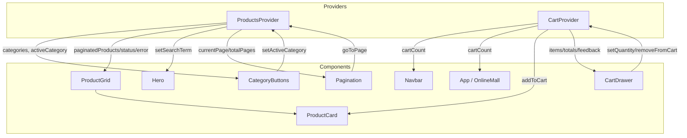

# State Management — Online Mall

## Why Context API instead of Redux

This app uses React's built-in **Context API** (`ProductsContext` + `CartContext`), not Redux.

- **Scale of the state is small and mostly UI-local.** There are two independent slices of shared state (product catalog / filters, and cart), not a large graph of interrelated domains. Redux's value grows with the number of slices, middleware, and cross-cutting concerns — none of which this app needs yet.
- **No complex async orchestration.** The only async work is a single `fetch` on mount (products) and one local cart "load" step. `useEffect` + `useState` inside a provider handles this cleanly without thunks, sagas, or RTK Query.
- **Fewer moving parts for a course project.** Context + local `useState` keeps the whole state layer in two files (`ProductsContext.jsx`, `CartContext.jsx`) that are easy to review and explain in the Loom walkthrough, versus Redux's store/slice/action/selector boilerplate.
- **React DevTools already shows it.** Since this is plain Context, the React DevTools "Components" panel can inspect each Provider's value directly — no separate Redux DevTools extension is required.

**When Redux would have been the better choice:** if the app needed time-travel debugging, a large number of independently-dispatched actions from many unrelated features, state shared across independent app entry points, or middleware (logging, persistence, undo/redo) — Redux Toolkit would earn its extra setup cost. That's not the case here.

## The two Providers

Both providers wrap the whole app in `main.jsx`:

```
<ProductsProvider>
  <CartProvider>
    <BrowserRouter>
      <App />
    </BrowserRouter>
  </CartProvider>
</ProductsProvider>
```

## State shape

### `ProductsContext`

```js
{
  products: Product[],          // full catalog fetched from the API
  filteredProducts: Product[],  // products after search + category filter
  paginatedProducts: Product[], // filteredProducts sliced to the current page
  categories: string[],         // derived from products
  status: 'idle' | 'loading' | 'success' | 'error',
  error: string | null,
  searchTerm: string,
  activeCategory: string | null,
  currentPage: number,
  totalPages: number,
  setSearchTerm(term),
  setActiveCategory(category),
  goToPage(page),
}
```

### `CartContext`

```js
{
  items: CartItem[],            // also exposed as cartItems
  status: 'idle' | 'loading' | 'success' | 'error',
  feedback: string,             // transient toast message, e.g. "Added to cart"
  totals: {
    itemCount, subtotal, discount, delivery, vat, total,
    sixMonthPayment, twelveMonthPayment,
  },
  cartCount: number,            // totals.itemCount
  cartTotal: number,            // totals.total
  addToCart(product),
  setQuantity(productId, quantity),
  removeFromCart(productId),
  clearCart(),
}
```

## Diagram — who reads/writes what



## Read/write matrix

| State slice | Provider | Read by | Written by |
|---|---|---|---|
| `products`, `status`, `error` | ProductsContext | `ProductGrid` | fetched internally on mount |
| `filteredProducts` / `paginatedProducts` | ProductsContext | `ProductGrid` | derived (`useMemo`) from `products`, `searchTerm`, `activeCategory`, `currentPage` |
| `categories` | ProductsContext | `CategoryButtons` | derived from `products` |
| `searchTerm` | ProductsContext | `ProductGrid` (via `filteredProducts`) | `Hero` (search form submit) |
| `activeCategory` | ProductsContext | `CategoryButtons`, `ProductGrid` (via `filteredProducts`) | `CategoryButtons` |
| `currentPage`, `totalPages` | ProductsContext | `Pagination` | `Pagination` (`goToPage`); reset automatically when search/category change |
| `items` / `cartItems` | CartContext | `CartDrawer` | `ProductCard` (`addToCart`), `CartDrawer` (`setQuantity`, `removeFromCart`, `clearCart`) |
| `totals`, `cartCount`, `cartTotal` | CartContext | `Navbar`, `App`, `CartDrawer` | derived (`useMemo`) from `items` |
| `feedback` | CartContext | `CartDrawer` | any cart-mutating action (`addToCart`, `setQuantity`, `removeFromCart`, `clearCart`) |

At least three components read shared state from each context (`ProductGrid`, `CategoryButtons`, `Hero`, `Pagination` for `ProductsContext`; `Navbar`, `ProductCard`, `CartDrawer` for `CartContext`), satisfying the "shared state used by at least 3 components" requirement.

## API call

`ProductsProvider` fetches the product catalog on mount:

```
GET https://dummyjson.com/products?limit=100
```

It uses an `AbortController` to cancel the request on unmount, and falls back to a small hard-coded `FALLBACK_PRODUCTS` list if the request fails.

## Verifying state live (for the Loom demo)

Open React DevTools → **Components** tab → select `ProductsProvider` or `CartProvider` in the tree → the `hooks` panel shows the current Context value. Interacting with search, category buttons, pagination, or "Add to Cart" updates the value live in that panel.
